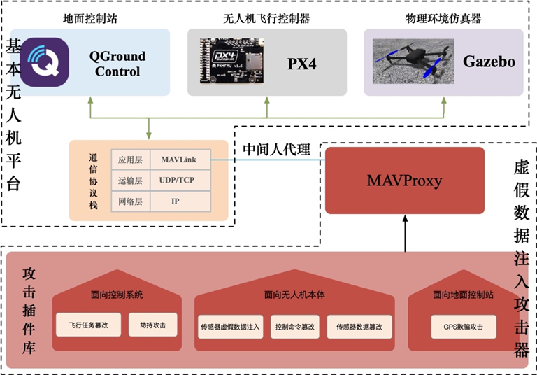
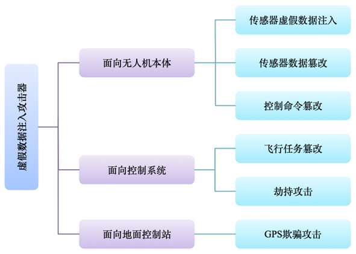
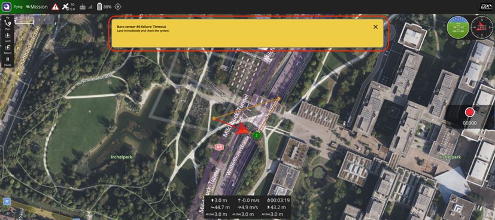
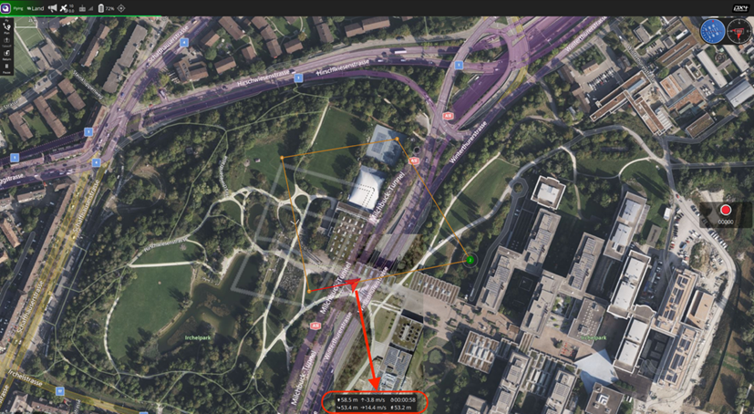
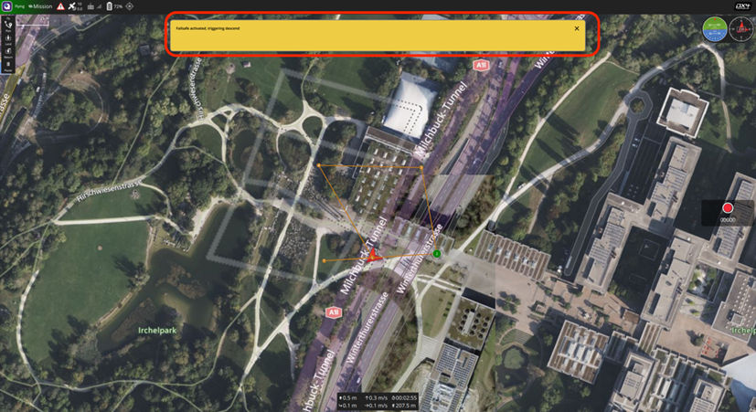
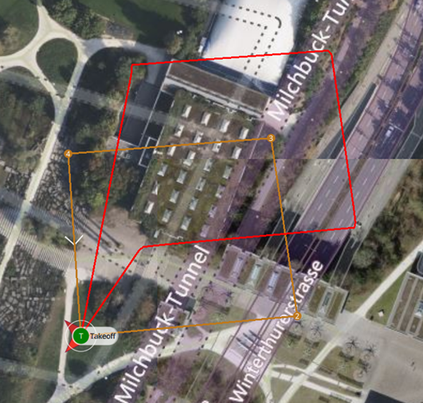
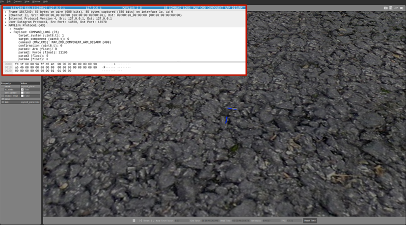
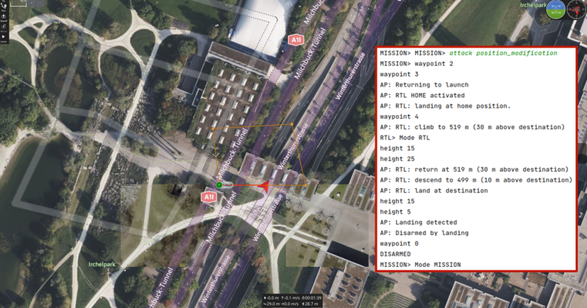

# MAVLink Attack Framework / MAVLink 攻击框架

[English](#english) | [中文](#chinese)

``

## English

This is an attack framework based on MAVProxy and pymavlink, designed to simulate and test various security threats against MAVLink-based drone systems.

### Project Overview

This project implements several attack modules to demonstrate potential security vulnerabilities in drone communication systems. The framework is built as a MAVProxy module, allowing for real-time interaction with drone systems.

### Key Features

- Hardware backdoor simulation
- Message modification attacks
- GPS spoofing
- Sensor injection and modification
- GCS (Ground Control Station) spoofing
- Velocity manipulation

### Attack Modules

The framework includes the following attack capabilities:

1. **Hardware Backdoor**: Manipulates actuator controls
2. **Message Modification**: Alters MAVLink messages in transit
3. **GPS Spoofing**: Modifies GPS coordinates
4. **Sensor Attacks**:
   - Sensor injection
   - Sensor modification
5. **GCS Spoofing**: Manipulates position data sent to ground control
6. **Reverse Velocity**: Affects vehicle movement parameters

### Usage

The attack module can be loaded in MAVProxy with different configurations:

- For QGC: `--master 127.0.0.1:14550 --out 127.0.0.1:14551 --cmd="module load attack"`
- For Gazebo: `--master=tcpin:127.0.0.1:4561 --out=tcp:127.0.0.1:4560 --cmd="module load attack"`
- For MAVROS: `--master 127.0.0.1:24540 --out 127.0.0.1:24541 --cmd="module load attack"`

#### Basic Commands

- Enable hardware backdoor: `attack hardware_backdoor on/off`
- Enable GPS spoofing: `attack gps on/off`
- Enable message modification: `attack message_modification`
- Enable reverse velocity: `attack reverse_velocity`

---

``

## 中文

这是一个基于 MAVProxy 和 pymavlink 的攻击框架，用于模拟和测试针对基于 MAVLink 的无人机系统的各种安全威胁。

### 项目概述
基本无人机平台由地面控制站QGC、无人机飞行控制器PX4和物理环境仿真器Gazebo组成，其中PX4与QGC、Gazebo之间使用协议栈内的协议进行通信，在没有网络攻击的情况下，能够实现正常的无人机飞行模拟。基于中间人代理模式的虚假数据注入攻击器，以MAVProxy为设计原型，利用其模块化的结构原理面向MAVLink协议设计攻击插件库。当用户下达加载插件的指令，相关的攻击插件配置到攻击器。

### 攻击模块

框架包含以下攻击功能:

### 攻击效果展示
1. **传感器数据篡改攻击**：MAVProxy会监听Gazebo与PX4通信过程中的所有数据包，并过滤出SENSOR_HIL数据包。然后，攻击插件会对有效负载中的xmag、ymag和zmag三个字段进行修改，最后将篡改后的HIL_SENSOR数据包转发到PX4。实验结果如图所示，在地面站中显示“Baro sensor #0 failure: Timeout”，无人机随即中断任务。

2. **传感器虚假数据注入攻击**：攻击者可以在无人机运行的任何时刻向其注入虚假传感器数据包，从而随时引发无人机失控或坠毁。在这种情况下，QGroundControl也会接收到错误的传感器数据，导致无人机的数据出现明显异常波动。最终，整个无人机系统混乱，各组件受到干扰而无法正常工作。
3. **控制命令篡改**：将HIL_ACTUATOR_CONTROLS消息中的controls字段全部设置为0.8时，对于四轴飞行器（四旋翼无人机），四个电机将接收到相同的控制信号。这可能导致飞行器在空中保持平衡，但不会执行其他复杂动作。然而，在某些情况下，例如飞行器的重心、电机功率以及其他外部因素（如风、湍流等）不满足平衡要求时，这种控制信号可能导致无人机失控甚至坠毁。

4. **飞行任务篡改攻击**：
在MAVProxy加载面向控制系统的虚拟数据注入攻击插件后，输入特定的攻击指令“mission_tampering”。需要注意的是，攻击应在无人机起飞前的飞行任务加载阶段进行。如图4-9所示，受到攻击后的无人机飞行轨迹发生变化：黄色线表示QGC原本设定的理想无人机轨迹，红色线表示受到飞行任务篡改攻击后的实际无人机轨迹。由图可见，任务点位置按照攻击设置沿x轴和y轴方向各偏移了一定距离，导致无人机偏离预定航线，从而证实攻击成功。

5. **劫持攻击**：在MAVProxy中加载面向控制系统的攻击插件，然后输入指令“disarm force”。实验结果如图4-10所示。通过Wireshark抓取的COMMAND_LONG数据包中，字段cmd的值为400，param1的值为0，而param2的值为21196，这证实了该数据包的目的是强制使无人机上锁。因此，在遭受劫持攻击之后，Gazebo界面显示的无人机直接坠落至地面，无法继续执行飞行任务。
6. **GPS欺骗攻击**：加载面向地面控制站的虚假数据注入攻击插件，并输入攻击指令“gps_spoofing”以实现GPS欺骗攻击。实验结果如图4-11所示。通过观察MAVProxy中显示的信息，我们可以判断出无人机仍然能够完成飞行任务，然而在QGC界面中，无人机已停止飞行。因此，GPS欺骗攻击导致QGroundControl地图上显示的无人机位置不再准确，操作员将无法通过地面控制站获取无人机的实时GPS信息。

### 使用方法

攻击模块可以在 MAVProxy 中以不同配置加载：

- QGC 配置: `--master 127.0.0.1:14550 --out 127.0.0.1:14551 --cmd="module load attack"`
- Gazebo 配置: `--master=tcpin:127.0.0.1:4561 --out=tcp:127.0.0.1:4560 --cmd="module load attack"`
- MAVROS 配置: `--master 127.0.0.1:24540 --out 127.0.0.1:24541 --cmd="module load attack"`

#### 基本命令

- 启用硬件后门：`attack hardware_backdoor on/off`
- 启用 GPS 欺骗：`attack gps on/off`
- 启用消息修改：`attack message_modification`
- 启用反向速度：`attack reverse_velocity`

### 文档说明 / Documentation

项目包含以下重要文档：

1. **msg文件和ulog转换后csv文件说明（传感器说明）**
   - 文件类型：PDF
   - 内容：详细说明了msg文件格式以及ulog日志转换为csv后的文件结构，包含传感器数据的详细说明

2. **测试子系统帮助文档**
   - 文件类型：PDF
   - 内容：提供测试子系统的使用说明和操作指南

3. **测试环境全流程帮助文档**
   - 文件类型：Word文档
   - 内容：完整描述测试环境的搭建和使用流程

所有文档都位于 `doc` 目录下，为项目的使用和测试提供全面的指导。

### 安全威胁建模实验

本项目进行了一系列系统性的安全威胁建模实验，主要包括以下几个方面：

#### 1. 多段上升悬停实验

该实验通过控制无人机进行多次上升和悬停动作，测试系统在持续运行状态下的稳定性和响应特性：

- 实验时长：60分钟
- 上升速度：1.4 m/s
- 悬停时间：180秒
- 单次上升距离：30米
- 重复次数：20次

#### 2. 激励信号切换周期实验

该实验通过在不同控制维度注入周期性的激励信号，测试系统的动态响应特性：

1. **姿态周期切换**

   - 测试无人机在不同姿态控制信号下的响应
   - 控制参数：
     * 滚转角（Roll）范围：±MAX_ANG_VEL（3 rad/s）
     * 俯仰角（Pitch）范围：±MAX_ANG_VEL（3 rad/s）
     * 偏航角（Yaw）范围：±MAX_ANG_VEL（3 rad/s）
   - 通过 MAVROS 消息接口进行姿态控制
   - 实验时长：30分钟
2. **水平位置周期切换**

   - 测试无人机在水平方向的位置控制性能
   - 控制参数：
     初始位置：（0，0，3.87m）

     * X轴位置变化步长：0.5米 周期0.5s
     * Y轴位置变化步长：1.5米 周期1.5s
     * 最大线速度限制：20 m/s
     * 切换周期：30分钟
   - 通过 ROS 话题进行位置控制
3. **高度周期切换**

   - 测试无人机在垂直方向的位置控制性能
   - 控制参数：
     * 初始悬停高度：3.87米
     * 高度变化步长：0.3米
     * 切换周期：30分钟
   - 通过速度指令实现高度控制

所有实验均采用以下安全限制：

- 最大线性速度：20 m/s
- 最大角速度：3 rad/s
- 实时位置和速度监控
- 自动边界检查和限制

这些实验的目的是全面评估无人机系统在不同攻击场景下的行为特性，为后续的安全防护措施提供依据。实验数据和结果可用于：

- 识别系统潜在的安全漏洞
- 评估攻击对系统性能的影响
- 验证防护措施的有效性
- 优化系统的安全性能
